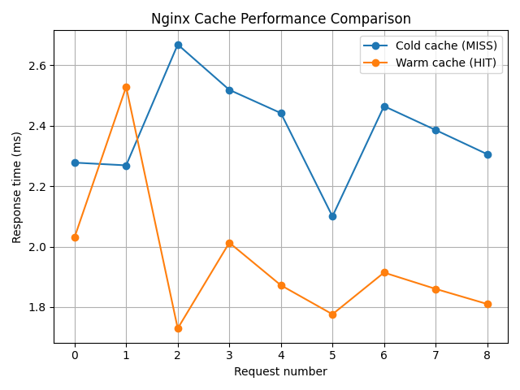

# MintCache — Nginx + Redis API Gateway on Linux Mint
MintCache is a backend infrastructure project built on **Linux Mint** that explores how an API gateway handles **caching, rate limiting, and system observability** using **Nginx, Redis, and FastAPI**.

The goal of this project was not just to make endpoints work, but to understand **real-world gateway behavior**, performance trade-offs, and infrastructure-level debugging.

# Architecture Overview
Client  
→ **Nginx** (Reverse Proxy + Cache)  
→ **FastAPI Backend**  
→ **Redis** (Rate-limit state)

- Nginx handles request routing and response caching
- Redis stores rate-limit counters
- FastAPI exposes application endpoints and system metrics
- Docker Compose orchestrates all services

# Features
- Nginx reverse proxy for backend services
- Response caching for expensive endpoints
- Redis-backed rate limiting logic
- Linux Mint–specific system health endpoint
- Containerized using Docker Compose
- Performance benchmarking with visual graphs

## Endpoints
# `/slow`
Simulates a slow backend response (2s delay) to demonstrate the effect of caching at the gateway layer.

# `/mint-health`
Returns Linux system metrics such as CPU usage, memory usage, disk usage, and uptime.
This endpoint is designed to be OS-aware and reflects the host Linux environment.

# `/health`
Simple service health check used for container and gateway verification.

# Performance Benchmarks
To measure the impact of caching, response times were collected for the `/slow` endpoint under two conditions:

- **Cold cache (MISS)** — first request hitting the backend
- **Warm cache (HIT)** — subsequent requests served from Nginx cache

The results show a significant reduction in response time once caching is applied.

# Design Notes & Trade-offs
- Redis-backed rate limiting logic was implemented to track request counts per client.
- Gateway-level enforcement was explored using Nginx subrequests.
- Practical limitations of using `auth_request` for non-auth policies (such as rate limiting) were identified and documented.
- The final design prioritizes clarity, debuggability, and realistic system behavior over excessive complexity.

# Tech Stack
- Nginx
- Redis
- FastAPI (Python)
- Docker & Docker Compose
- Linux Mint

# Key Takeaways
- How API gateways handle caching and request routing in practice
- How Redis can be used for lightweight state management
- The importance of cache vs policy ordering
- Debugging containerized infrastructure using logs and metrics
- Benchmarking backend performance using real measurements instead of assumptions

# Why This Project?
This project was built to gain hands-on experience with backend infrastructure concepts that are often abstract in tutorials — focusing on how systems behave under real conditions, how trade-offs emerge, and how to debug them effectively.
